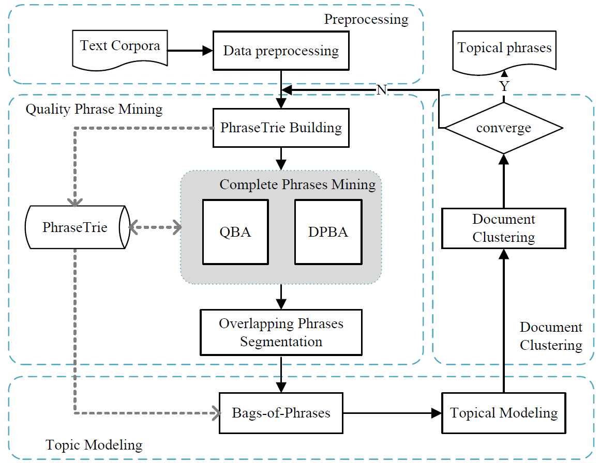

## Coherence and Salience-Based Multi-Document Relationship Mining

We propose a unified framework to aid users in quickly discerning salient connections and facts from a set of related documents, and presents the resulting information in a graph-based visualization.

You can use the [editor on GitHub](https://github.com/shengyp/Multi-doc-rel-min/edit/master/index.md) to maintain and preview the

### The Framework of Our Approach



In summary, this framework can be best described as a combination of three major subtasks:

-   **Subtask 1: Candidate Facts Extraction.**
    

-   Subtask 2: Candidate Facts Extraction.**
    

**1. Candidate Facts Extraction**

-   **Document Ranking**
    

-   **Coreference Resolution**
    

-   **Sentence Ranking**
    

To illustrate this, we shall consider an example sentence is ”George .” Such a sentence yields a number of triples, among which we may find (The United States, President, Trump), (noun phrase, relation phrase, noun phrase), (noun phrase, relationphrase, noun phrase).

**2. Topic Coherence Estimation of Candidate Facts**

**3. Conceptual Graph Construction**

The reached data from prior fact extraction module can be filtered such that only the most salient, confident, and compatible facts are maintained. That is, fact filtering module aims at hiding less representative facts in the visualization and the filtered results can be retrieved from [here](https://github.com/shengyp/Multi-Docs-semantics/blob/master/data/elections/filtering-facts).

$$
  I_{i}= (1 - d)\sum_{j \in N(i)}\frac{w_{ji}}{\Sigma_{k\in N(j)}w_{jk}}I(j) + d \cdot p_{i},
$$

where $N(i)$ stands for the set of the node $v_{i}$'s neighbors.

### Dataset

The reached data from prior fact extraction module can be filtered such that only the most salient, confident, and compatible facts are maintained. That is, fact filtering module aims at hiding less representative facts in the visualization and the filtered results can be retrieved from[here](https://github.com/shengyp/Multi-Docs-semantics/blob/master/data/elections/filtering-facts).

### Code Repository

The code used in this paper will be updated after the work be accepted.

```markdown
Syntax highlighted code block

# Header 1
## Header 2
### Header 3

- Bulleted
- List

1. Numbered
2. List

**Bold** and _Italic_ and `Code` text

[Link](url) and 
```

For more details see [GitHub Flavored Markdown](https://guides.github.com/features/mastering-markdown/).

### Jekyll Themes

Your Pages site will use the layout and styles from the Jekyll theme you have selected in your [repository settings](https://github.com/shengyp/Multi-doc-rel-min/settings). The name of this theme is saved in the Jekyll `_config.yml` configuration file.

### Support or Contact

Having trouble with Pages? Check out our [documentation](https://help.github.com/categories/github-pages-basics/) or [contact support](https://github.com/contact) and we’ll help you sort it out.
